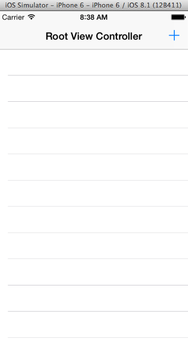
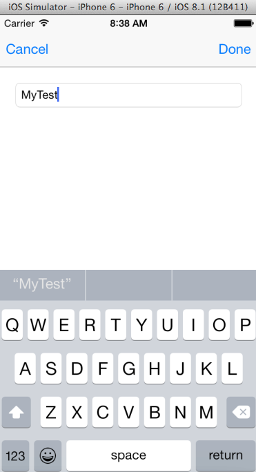
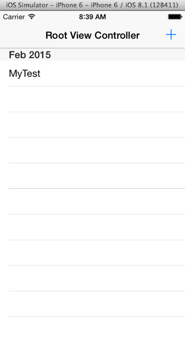

README
============

About
-------

Applied code from the [Build a Diary App using Core Data] course by [TeamTreehouse](https://teamtreehouse.com/subscribe/plans?trial=yes&referrer=lukeschoen&utm_source=Referral%20Program&utm_medium=url&utm_campaign=Referral%20URL) using Xcode. Core Data is used to coordinate transfer of Managed Object Context data with the Persistent Store.

Progress
-------

Completed.

Requirements
-------

* [Xcode](https://developer.apple.com/xcode/downloads/)

Setup
-------

1. **Download Xcode**

2. **Setup**
  * Clone or Fork: [Diary App repository](https://github.com/ltfschoen/diary.git)
  * Option #1 (Run in iOS Simulator)
    - Choose Target Device (Xcode > Menu > Product > Destination > iPhone 6)
      Note: Scroll to top in the iPhone Simulator if you use iPhone 6 Plus or iPad)
    - Run in iOS Simulator (Xcode > Menu > Product > Run)
      Note: Shortcut is CMD + R
  * Option #2 (Run on iOS Device)
    - Connect iOS Device to Mac via USB
    - Choose Target Device (Xcode > Menu > Product > Destination > iOS Device)
    - Run on iOS Device (Xcode > Menu > Product > Run)

Screenshots
-------

Troubleshooting
-------

* Reset iOS Simulator (iOS Simulator > Reset Contents & Settings > Reset)